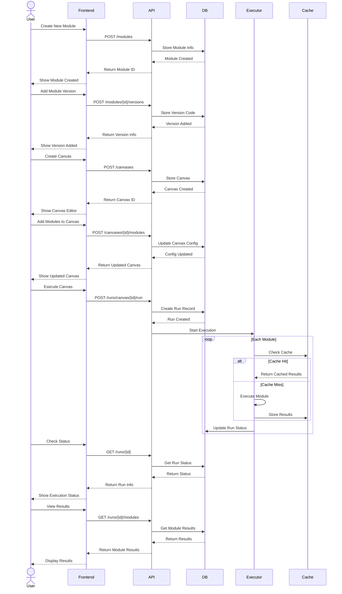

# ML Pipeline UI

A modern, drag-and-drop interface for building machine learning pipelines with versioning and caching capabilities.

## Features

- 🔄 Drag-and-drop pipeline creation
- 📊 Visual pipeline builder
- 💾 Module versioning
- ⚡ Run caching
- 📅 Pipeline scheduling
- 📈 Performance monitoring
- 🔍 Model version comparison
- 🚀 Easy deployment options

## Getting Started

### Prerequisites

- Node.js (v14 or higher)
- npm or yarn

### Installation

1. Clone the repository:
```bash
git clone https://github.com/$GITHUB_USERNAME/ml-pipeline.git
cd ml-pipeline
```

2. Install dependencies:
```bash
npm install
```

3. Start the development server:
```bash
npm start
```

### API Architecture



The application will open in your default browser at `http://localhost:3000`.

## Deployment to GitHub Pages

### Manual Deployment

1. Update the `homepage` field in `package.json` with your GitHub username:
```json
{
  "homepage": "https://$GITHUB_USERNAME.github.io/ml-pipeline"
}
```

2. Deploy to GitHub Pages:
```bash
npm run deploy
```

### Automatic Deployment

The repository is configured with GitHub Actions for automatic deployment:

1. Push your changes to the `main` branch
2. GitHub Actions will automatically build and deploy to GitHub Pages
3. Your site will be available at `https://$GITHUB_USERNAME.github.io/ml-pipeline`

## Setting up GitHub Pages

1. Go to your GitHub repository settings
2. Navigate to "Pages" in the sidebar
3. Under "Source", select "Deploy from a branch"
4. Select the `gh-pages` branch and `/ (root)` folder
5. Click "Save"

## Development

### Project Structure

```
src/
  ├── components/         # React components
  │   ├── ModulePalette.tsx    # Module selection sidebar
  │   ├── CanvasArea.tsx       # Main pipeline canvas
  │   ├── ModuleNode.tsx       # Individual module component
  │   ├── Toolbar.tsx          # Top toolbar
  │   └── ...
  ├── types/             # TypeScript type definitions
  └── App.tsx            # Main application component
```

### Available Scripts

- `npm start` - Start development server
- `npm build` - Build for production
- `npm test` - Run tests
- `npm run deploy` - Deploy to GitHub Pages

## Contributing

1. Fork the repository
2. Create your feature branch (`git checkout -b feature/AmazingFeature`)
3. Commit your changes (`git commit -m 'Add some AmazingFeature'`)
4. Push to the branch (`git push origin feature/AmazingFeature`)
5. Open a Pull Request

## License

This project is licensed under the MIT License - see the [LICENSE](LICENSE) file for details. 